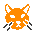
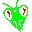
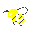
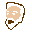

# Devgeon

## Compilación/Instalación

El juego está hecho con [Godot](https://godotengine.org/), por lo que es necesario instalarlo.

Una vez instalado sólo es necesario abrir *project.godot* y compilarlo o ejecutarlo.

## Características

Juego de temática roguelike con las siguientes características:

- Permadeath.
- Gameplay por turnos.
- Control de recursos.
- 1 solo jugador.
- Idioma: Castellano.
- Soporte para múltiples objetos:
  - Pociones de velocidad.
  - Bazookas.
  - Martillos.
- Historia.
- Distintas dificultades.
- Música ambiental.

## Desarrollo de la historia

Al comienzo de tu aventura en Devgeon, se te encomienda una misión de rescate donde debes salvar a los siguientes personajes:

El gato.

La mantis.

El perro.

La abeja.

El desarrollador (Gamedev)
